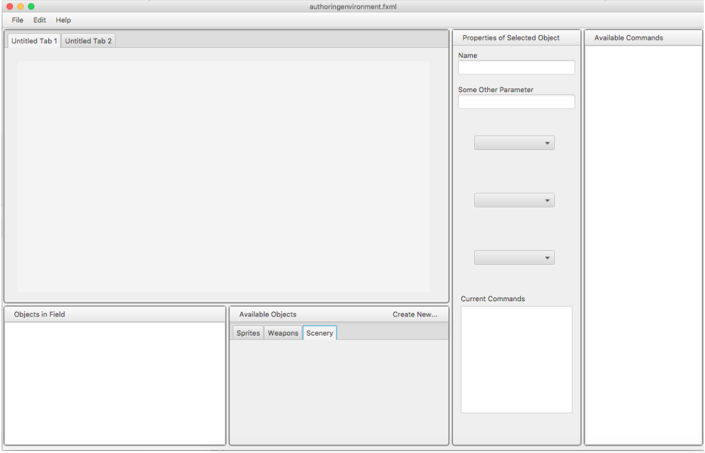

# Design

## Introduction
Our goal is to make a game authoring engine that allows users to build a Top-Down Base Defense game and run it. This genre consists of a 2D map on which there are base zones/structures that set the win condition (ie destroying enemy base). The players will defend their own base while defend their own base in some way. The engine should allow the user to customize the type of game (win condition) as well as more specific edits for the game. These edits will include attributes that characters have as well as specific number data regarding abilities. The main source of flexibility will be from these more specific edits that change characteristics of players and abilities. 

## Overview

### Game Engine:  
The game engine will consist of the sprites, rules, and scenery that will be used to author game data files.  The game authoring environment creates games by instantiating and customizing versions of these entities.  When the player runs a game data file, the game engine will handle running the actual game.  It will determine all of the sprite locations and speeds, collisions, rules, and win/lose conditions.

## User Interface
The complete user interface for this project has two main parts: the authoring environment UI and the game player UI.

### Authoring Environment
The authoring environment has been divided into four main sections to give the user the control and information needed to create an amazing game. The sections are as follows: the Level View, the Properties Viewer, the Commands List, and the Objects List. An example of what the program might look like is shown below.

<!-- There will be some changes but for the most part this is the idea -->

#### Level View
The level view is the section of the UI where the user constructs the levels for the program. Each level for the game is contained within a separate tab in this area, and users can easily switch between editing levels by selecting a different tab. Additionally, users can set the level background from a selection of different background images. Users can select and drag sprites or scenery into this area to place them on the level.
#### Properties Viewer
By clicking on an object in either the objects list or level view, the user can view all of its properties in the properties viewer section of the UI. For example, by clicking on a sprite, you can see its name, its image file, its position on the field, the commands that it has been assigned, and more. This is also the section where the user will able to change all of these parameters.
#### Commands List
The commands list will have all the available commands for objects. Once the user has selected an object, they can then drag and drop commands from the available command list to the current commands window in the properties viewer. 
#### Objects List
The objects list will contain all objects that are currently in the level view and each object will each be selectable and can be deleted from the level. The user can also select to add a new object to the level. When they do select to add a to add a new object, a new list will pop up with all the available objects and their category, ie scenery, weapon, sprite etc. 

### Game Player

The game player will be able to display any given game.  It will be broken down into a variety of classes.  It will primarily interact with the ExternalEngine object through the engine controller and our Data system through an External Data object initialized through the DataController. It will be able to display all of the games that are available to play and also be able to play multiple games, save games, set settings, and track achievements among other such game console like functionality. 

## Design Details

### Game Engine: 
We will be implementing an entity-component-system.  Each entity in the game engine hierarchy will at first be differentiate from other objects by its attributes, which are essentially the most primitive type of components.  An entity will obtain attributes by implementing multiple attribute interfaces, each with a default method (this is done as a work-around to allow multiple-inheritance).  Each entity in the game engine can then be further modified via abilities, which are normal components.  Each entity will contain a list of ability components that further modify beyond the basic attributes of the object.  Both the attributes and abilities will effectively hold all of the raw data of the game.  Systems will then iterate over the entities with relevant components to apply the rules and conditions of the game, determining when events should be generated such as achievements, deaths, wins, loses, collisions, etc.

####Game Authoring Environment 
We will be implementing panes to create our view of the authoring environment. Level design fields will be implementing a tab pane to be able to edit multiple levels at one time. The inner parts of the tab pane will be split using a border pane, where we can make the field, available commands, properties, and objects all a section of the pane. These sections will than either be a list of commands using a box or a combination of other panes and javafx scene elements to make our desired authoring environment. The toolbar across the top of the screen shown above will be a group of buttons that allow the user to select various settings and options while they are editing the game. We will be getting all the available commands and sprites and objects for the scene from the game engine and just assigning commands/abilities to the sprites/objects.  

## Example Games

### SLeague of SLegends
This game type involves two teams, each with a base structure, where the goal of the game is to destroy the enemy base. The two teams will each have multiple players fighting/kill each other to progress further towards the enemy base to destroy it. Along the way, there will be certain additional structures (turrets) that will need to be destroyed before the base can be destroyed. The first team to destroy the enemy base wins.

### Capture the Flag
This game type involves two teams, each with a carryable flag and a base zone, where the goal of the game is to grab the enemy flag and reach your own team’s base zone. The two teams will each have multiple players that will fight/kill each other to defend their flag and get the enemy flag back to their base. The first team to get to a certain number of flags captured wins.

### Hidden in Plain Sight
This game type involves multiple players where the goal is to reach all of the bases on the screen while going undetected from other players. This game will involve multiple human players as well as multiple computer players. Players will try to blend in with the computer players who are set to AI movement paths. If identified, players can be attacked. The first player to make it to all bases while going undetected wins.

##Game Player 
The Game Player will be broken down into 8 sub packages each with a specified functions and classes to fulfill that function 

###Home 
The home package contains home.java which will produce a node that contains a list of all the games and the users current achievments for those games to be displayed. The classes in this package satisfy this purpose. 
The GameChoice class will display a single Game and its title for selection by the user. 
GameChooser is a list of GameChoice nodes for the user to choose from. 
Home will contain the GameChooser and all other elements of the home screen for the game player. 

###Display 
Hold the display class and interface which will be have the init method that is called to startup the application as a whole.  Will also contain the step method.  The ExternalEngine will be updated upon each step of the step method. 
The display package also contains SetLevel which will set up a pane with all of the sprites and background images provided by the ExternalEngine. 
The display package also has the HeadsUpDisplay class which will interactively update user achievements and game info during game play. 
The DisplayInterface contains the only piece of the external API which is the init method. 

### controller 
This package contains the EngineController which initializes and ExternalEngineInterface and also contains the DataController class which will initialize a ExternalDataInterface. It will pass these objects to the appropriate classes. 
###  achievements
The achievements package is designed with the purpose of managing and displaying achievements.  The AchievementsVisualizer will be capable of graphically displaying the achievements have earned for a given game. The achievements tracker will store and track the achievements a user has earned for a given game. 

### global 
The global package contains the HomeMenu class which acts a global menu that is accessible through all parts of the game player.  This menu will allow the user to return home and, if the user is currently playing a game, the menu will allow the user to start, pause, save and request help for a given game. 

###File Reading 
This package contains classes that read and parse all of the information necessary for setting up the game player.  This includes FindGame which finds all of the current possible games. 
LoadPreferences which loads previously saved GamePreferences.  ReadAchievments which will load previously saved achievments. It also contains a styling class that reads a CSS style for the styling the user wished to apply to the game and game elements such as fonts and the HUD. 

### File Writing 
The WriteAchievments class will write the current user achievements for a game and then save them to a file. 
The WritePreferences will allow the user to save their preferences to be applied to a current play. 

###gameengine
The gameengine package will contain 3 subclasses: entities, components, and systems. The components subpackage will additionally contain and Abilities and Attributes package. These represent the entity component system that the gameengine will be designed on. The base gameengine package will also contains the file parsing objects required to initialize the engine. 

## Design Considerations

The main design considerations came in the communication between the gameengine and gameplayer, particularly when it came to certain limitations in JavaFX. The question came with how to manage the JavaFX Scene and the ImageViews that would be representing backend objects in the engine. We knew that the player would be displaying the ImageViews on its own scene, but what we didn’t know was how much the backend should know about the scene and ImageViews. The pros to keeping everything in the frontend is that it limits the effects of the backend on user visualization. The pros to moving the ImageViews into the backend is that it makes collision detection much easier, which is absolutely essential in our genre of game. The pro to giving Scene access to the engine is that it makes keybinding and mouselistening easier and more fluid. Instead of passing user actions back, it would be handled completely in the backend. 

We decided that there wasn’t an easy enough way to handle collisions in ImageViews without access to those exact objects, so the ImageViews had to be held in the backend. Further we found that creation of Key and Mouse input could be included in the external API of the engine, meaning that the Scene would remain encapsulated by the Gameplayer. 

The last design constraint has to do with our Data System. We currently have ideas available for our data system, but are unsure on how changes to our APIs may change the data system. None of us have used data files in such an intensive way, so these changes become very hard to predict. 
